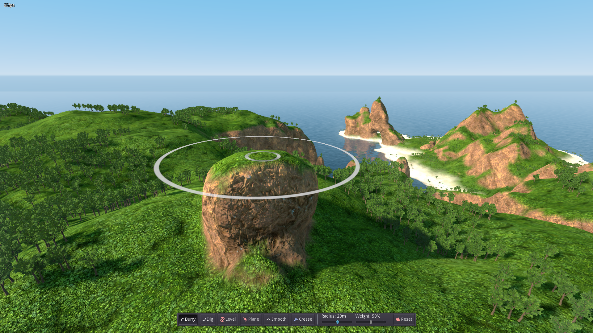

# Reckless Wings - Map Editor

A customizable map generator and real-time terrain editor for the game [Reckless Wings](https://github.com/Pro1d/Reckless-Wings).

## Voxel Grid

The real time terrain sculpting is made possible by using voxel grids.
It uses [godot_voxel plugin](https://github.com/Pro1d/godot_voxel) which is a fork of [Zylann/godot_voxel](https://github.com/Zylann/godot_voxel).

## Preview

Customizable island generator within godot editor:

Real-time terrain editing:

